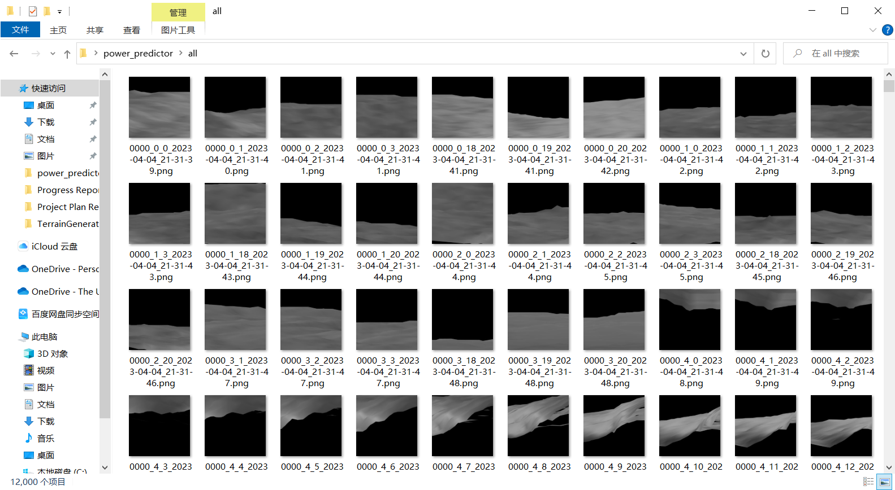
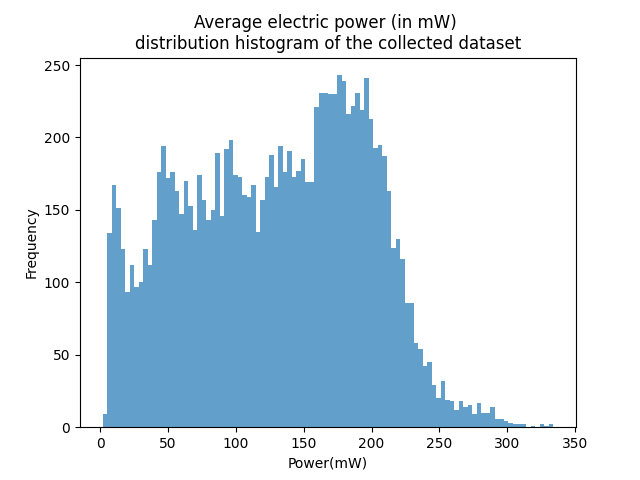
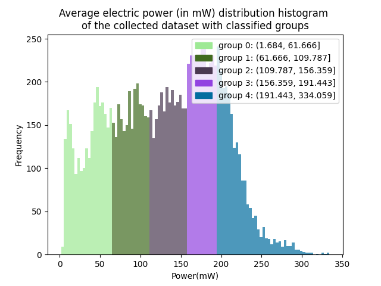
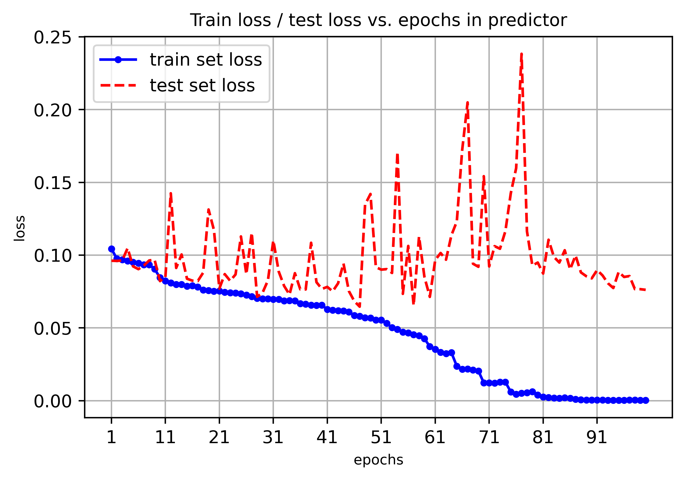
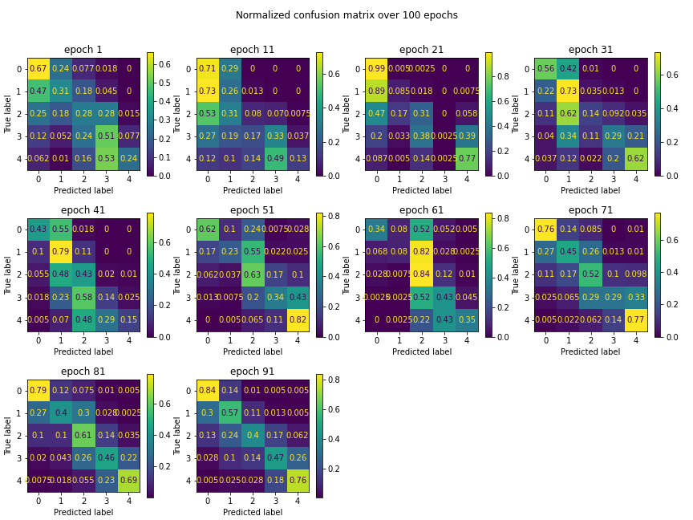

# Power Predictor

## Table of Contents

- [About](#about)
- [Getting Started](#getting_started)
- [Example Usage: data preprocessing](#example_usage_1)
- [Example Usage: model training and metrics plot](#example_usage_2)

## About <a name = "about"></a>

The power predictor is part of the program I wrote for 'vibration-based harvester simulator' as author's final year project (FYP) for predicting the power generated if the car has the vision of its front view (using Unity3D built-in camera)

This project contains two smaller modules: the data preprocessing modules and deep learning-based training models using convolutional neural network (ResNet-18)

While the latter one might be less useful. The first module can be of great help if you want to make you own dataset

## Getting Started <a name = "getting_started"></a>

These instructions will get you a copy of the project up and running on your local machine for development purposes.

### Prerequisites

#### 1. Downloading Dataset

The dataset has been uploaded here: https://drive.google.com/file/d/18BxfMAJ21_QyM8mmeebyPGBXAiSxYM2I/view?usp=share_link

Please download the `dataset.zip` containing 12,000 1024x1024 images for the training of the model. After unzipping the file, please copy all the images to `all` folder under the root folder

#### 2. Development Environment

The script is writing using Python. 

- An Python running environment
  - https://www.python.org/downloads/

For external libraries dependencies, please install the following packages:

- Numpy
- Pandas
- Matplotlib
- scikit-learn
- PyTorch (deep-learning framework)
- tqdm (for progress bar illustration)

by entering the following command using `pip`

```bash
$ pip install numpy matplotlib pandas scikit-learn tqdm 
```

Pytorch installation may differ from different operating systems. For more information, please refer to the official documentation for installation at: https://pytorch.org/get-started/locally/

- Windows Users (with GPU acceleration)

```bash
$ pip3 install torch torchvision torchaudio --index-url https://download.pytorch.org/whl/cu117
```

- Windows Users (without GPU acceleration)

```bash
$ pip3 install torch torchvision torchaudio
```

- Mac Users

```bash
$ pip3 install torch torchvision torchaudio
```

For Mac Users, mps acceleration (similar to CUDA) is available for system requirement of MacOS 12.3+

- Linux Users

```bash
$ pip3 install torch torchvision torchaudio --index-url https://download.pytorch.org/whl/cpu
```

## Example Usage: data preprocessing <a name = "example_usage_1"></a>

First, all training images should be put in a universal file folder, for example, I put all of the terrain images in 'all' folder



Also remember to include the data file that includes the energy produced for each image, for example, I put the data in the 'data1.csv' that looks like the following:

| terrainID | position | direction | average_power |
| --------- | -------- | --------- | ------------- |
| 0000      | 0        | 0         | 174.522       |
| 0000      | 0        | 1         | 200.252       |
| 0000      | 0        | 2         | 221.1896      |

After that, create a new Python file named `preprocessing.py` at the root directory, add the following code to start preprocessing automatically:

```python
from Data.Preprocessing import Preprocessing

if __name__ == '__main__':
    power_data_csv_path = 'data1.csv'
    src_folder_path = 'all'
    train_dst_folder_path = 'train'
    test_dst_folder_path = 'test'
    train_size = 5.0/6.0
    num_classes = 5
    after_processing_data_file = 'data1_after_processing.csv'

    p = Preprocessing(power_data_csv_path=power_data_csv_path,
                  src_folder_path=src_folder_path,
                  train_dst_folder_path=train_dst_folder_path,
                  test_dst_folder_path=test_dst_folder_path,
                  train_size=train_size,
                  num_classes=num_classes,
                  after_processing_data_file=after_processing_data_file)
    p.start()
```

The variable `train_dst_folder_path` refers to the folder path for the training set. Images that have been relocate as the training set will be saved here. Similarly, `test_dst_folder_path` refers to the folder path for the testing set. `train_size` refers to the ratio of train vs all. In this case, the training set is 5/6 of the whole dataset, making the testing set 1/6 of the whole dataset. `num_classes` is needed when labelling the whole dataset, please specify how many classes you would like to separate the whole dataset.  `after_processing_data_file` is the path where you want to store the data after the data has been labelled and classified. Sample dataset after classification looks like this:

| terrainID | position | direction | average_power | power_group |
| --------- | -------- | --------- | ------------- | ----------- |
| aa7z      | 4        | 9         | 22.25215      | 0           |
| aa7z      | 4        | 8         | 87.67899      | 1           |
| aa7z      | 4        | 7         | 25.10275      | 0           |

Now run the code, the system will do following output automatically

```
[INFO] Read original power data
[INFO] Filter the image manually selected...
100%|██████████| 12000/12000 [00:19<00:00, 605.19it/s]
[INFO] Filter successful, whole dataset size: 12000
[INFO] Drawing histogram of the power distribution
[INFO] Assigning labels to the dataset ...
[INFO] The distribution of the average power is shown as belows: 
(1.684, 61.666]    				2400
(61.666, 109.787]               2400
(109.787, 156.359]              2400
(156.359, 191.443]              2400
(191.443, 334.059]              2400
Name: power_group, dtype: int64
[INFO] Dataset after processing has been saved to data1_after_processing.csv
[INFO] Drawing histogram after classification
[INFO] locating training files
100%|██████████| 10000/10000 [00:23<00:00, 420.74it/s]
[INFO] locating testing files
100%|██████████| 2000/2000 [00:09<00:00, 216.77it/s]
[INFO] Copying files ...
File copy: 100%|██████████| 12000/12000 [02:00<00:00, 99.71it/s] 
[INFO] Copying files finished
```

With two output images displaying the distribution of power value before and after the labelling:





After the preprocessing, the images originally in the 'all' folder will be distributed according to different power group in both training and testing folder

## Example Usage: model training and metrics plot <a name = "example_usage_2"></a>
You can use the 'predictor.py' as an template for training and testing your model. Here I'd like to briefly introduce the usage of some metrics plotting functions
1. `draw_loss(loss_list_train: list[float], loss_list_test: list[float], num_epochs: int, plot_interval: int)`
    This function can be used to draw the loss for whole number of epochs. Specifically, if you plan to train the model for 10 epochs, the `num_epochs` in this case is 10. `plot_interval` is for plotting purposes, to only display the data for a fixed period of time. For example, if the `plot_interval` for the former case is 2, then the plot will plot 0, 2, 4, 6, 8 at the x-axis.

2. `draw_confusion_matrix(y_test_list: list[list[int]], y_pred_list: list[list[int]], num_epochs: int, plot_interval: int)`

  This function can be used to draw the confusion matrix for whole number of epochs. `y_test_list` contains the true label of each batch when training the model.  `y_pred_list` contains the prediction label of each batch when training the model. For example, if in batch one the true label is [1, 2, 3, 4, 5], while the predicted label is [1, 3, 2, 4, 5], and in next batch, the true label is [5, 4, 3, 2, 1], while the predicted label is [5, 2, 4, 3, 1]. Then `y_test_list` is [[1, 2, 3, 4, 5], [5, 4, 3, 2, 1]], while the `y_pred_list` is [[1, 3, 2, 4, 5], [5, 2, 4, 3, 1]].

The standard procedure for training and testing in PyTorch:

```python
def train(model, train_loader, loss_fn, optimizer, device):
    # State that you are training the model
    model.train(True)
    for batch_idx, data in enumerate(train_loader, 0):
        inputs, labels = data[0].to(device), data[1].to(device)
        # zero the parameter gradient
        optimizer.zero_grad()
        # forward propagation
        outputs = model(inputs)
        # calculate loss using the loss function
        loss = loss_fn(outputs, labels)
        # back propagation
        loss.backward()
        # output the value with the highest probability
        _, pred = torch.max(outputs, 1)
        # update the parameter
        optimizer.step()
        
def test(model, test_loader, loss_fn, device):
    # State that you are testing the model;
    model.eval()
    # no need for back-propagation
    with torch.no_grad():
        inputs, labels = data[0].to(device), data[1].to(device)
        outputs = model(inputs)
        # calculate loss using the loss function
        loss = loss_fn(outputs.data, labels).item()
        _, pred = torch.max(outputs, 1)

if __name__ == '__main__':
    # choose acceleration platform
    # windows
    if torch.cuda.is_available():
        device = 'cuda'
    # mac
    if not torch.backends.mps.is_available():
    	if not torch.backends.mps.is_built():
        	print("MPS not available because the current PyTorch install was not "
              	  "built with MPS enabled.")
    	else:
        	print("MPS not available because the current MacOS version is not"
                  " 12.3+ and/or you do not have an MPS-enabled device on this"
                  " machine.")

	else:
    mps_device = torch.device("mps")
    
    # assume you have your train_loader and test_loader ready:
    # the train loader for the whole dataset
    train_loader = torch.utils.data.DataLoader(trainset, 
                                               batch_size=train_batch_size,
                                               shuffle=True, num_workers=0)
    # the test loader for the whole dataset
    test_loader = torch.utils.data.DataLoader(testset, batch_size=test_batch_size,
                                              shuffle=False, num_workers=0)
    # skip some necessary set up
    for epoch in range(1, num_epochs + 1):
        train(model=model, loss_fn=loss_fn, optimizer=optimizer, \
              train_loader=train_loader, device=device)
        test(model=model, loss_fn=loss_fn, epoch=epoch, test_loader=test_loader,
             device=device)
```

If you want to draw the loss for train, simply add loss to be calculated in a list:

```python
def train(model, train_loader, loss_fn, optimizer, device):
    total_loss = 0
	# ...
    total_loss += loss_fn(outputs, labels).item()
    # ...
	
    loss_list_train.append(total_loss / len(train_loader.dataset) * 1.0)
```

Similarly, if you want to draw the loss for test:

```python
def test(model, test_loader, loss_fn, device):
    total_loss = 0
    # ...
    total_loss += loss_fn(outputs, labels).item()
    # ...
    
    loss_list_test.append(total_loss / len(test_loader.dataset) * 1.0)
```

If you want to draw the confusion matrix for train, simply add the following code in testset:

```python
def test(model, test_loader, loss_fn, device):
    y_truth_list = []
    y_pred_list = []
    with torch.no_grad():
        # ...
        inputs, labels = data[0].to(device), data[1].to(device)
        # transfer the data[1], which is label, from tensor (in GPU) to CPU
        # and transform to an numpy array
        y_truth_list.append(data[1].cpu().numpy())
        outputs = model(images)
        _, pred = torch.max(outputs, 1)
        # transfer the pred, which is the label that has the highest possibility
        # and transform to an numpy array
        y_pred_list.append(pred.cpu().numpy())
        # ...
```

The sample train-test plot and confusion matrix looks like this.





If you want to use the model I trained, please download the `resnet18_terrain_predictor_2023-04-15_21-29-40.pth` at https://drive.google.com/file/d/1UVgL3ygTcgvq5Z5Xkh_S71606ay-aNHD/view?usp=share_link
