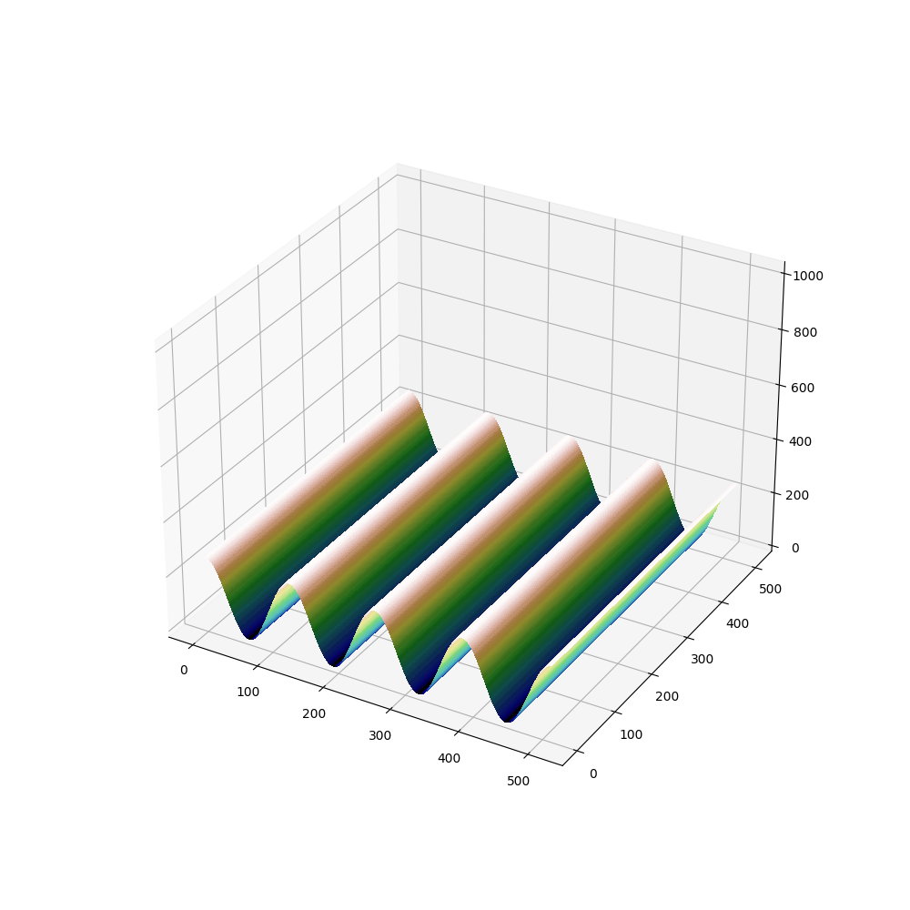
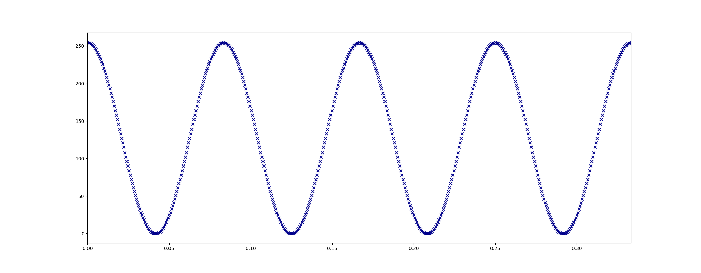
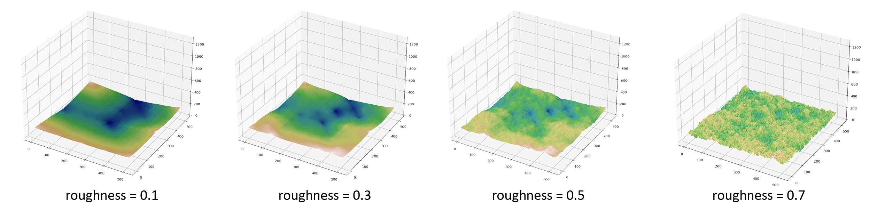

# Unity3D Terrain Generation Utility

## Table of Contents

- [About](#about)
- [Getting Started](#getting_started)
- [Example Usage: Generate a Cosine form terrain height array](#example_usage1)
- [Example Usage: Generate a same height terrain height array](#example_usage2)
- [Example_Usage: Generate random height terrain height array](#example_usage3)
- [Additional Utility functions](#additional_utility_functions)
- [Automation](#automation)

## About <a name = "about"></a>

The terrain generation is part of the utility program I write for 'vibration-based harvester simulator' as author's final year project (FYP) for generating designated form of terrain in Unity3D.

If you want to create a Cosine-form or Sine-form of terrain in Unity3D by importing the RAW file, then this project is suitable for you.

## Getting Started <a name = "getting_started"></a>

These instructions will get you a copy of the project up and running on your local machine for development.

### Prerequisites

The script is writing using Python. For external libraries dependencies, please install the following packages

- An Python running environment
  - https://www.python.org/downloads/

After installing Python, please install the following packages using `pip`

- Numpy
- Matplotlib
- Tqdm (for progress bar illustration)

by entering the following command

```bash
$ pip install numpy matplotlib tqdm
```

## Example Usage: Generate a Cosine form terrain height array <a name = "example_usage1"></a>

For start, you can create a `FixFormGenerationTest.py` file at the root folder:

```python
from TerrainGeneration.FixedFormTerrain import FixedFormTerrainGenerator

fftg = FixedFormTerrainGenerator(freq=12, shape=(513, 513), num_of_period=4, min_height=0, max_height=255)
height_matrix = fftg.generate(kind='cosine')
```

The parameters are introduced below:

| parameter     | type              | info                                              |
| ------------- | ----------------- | ------------------------------------------------- |
| freq          | `float`           | The frequency of the wave, measured in Hertz (Hz) |
| shape         | `Tuple[int, int]` | Size of the terrain height matrix generated       |
| num_of_period | `int`             | The number of periods of the wave to generate     |
| min_height    | `int`             | minimum height in the terrain height matrix       |
| max_height    | `int`             | maximum height in the terrain height matrix       |

Then a cosine terrain array will be generated in the size of (513, 513)

If you want to see whether the height_matrix is what you want, you can visualize it by adding the parameter `visual` in the `generate` method:

```Python
height_matrix = fftg.generate(kind='cosine', visual='3d')
```

This will generate a visualization (3d) that looks like below:


If you just need the curve, then simply change `'3d'` to `'2d'` as `'3d'` generation are slow

```Python
height_matrix = fftg.generate(kind='cosine', visual='2d')
```

which gives you the curve you want:



## Example Usage: Generate a same height terrain height array <a name = "example_usage2"></a>

This simply creates a flat terrain at a specified height

Simply changing the usage above by changing the parameter to `'same'`

```Python
fftg = FixedFormTerrainGenerator(freq=12, shape=(513, 513), num_of_period=4, min_height=0, max_height=255)
height_matrix = fftg.generate(kind='same', same_height=255)
```

Please remember to have the height specified, otherwise by default a height of 255 terrain matrix will be produced. 

## Example Usage: Generate a random height terrain height array <a name = "example_usage2"></a>

For most cases, all we want is the terrain of random form that emulates the real-life terrain

The terrain generation utilizes diamond square algorithms, with a little modifications

For start, you can create a `FixFormGenerationTest.py` at the root folder:

```python
from TerrainGeneration.RandomFormTerrain import RandomFormTerrainGenerator

rftg = RandomFormTerrainGenerator(shape=(513, 513), roughness=0.1, random_seed=1, min_height=0, max_height=255)
height_matrix = rftg.generate()
```

The parameters are introduced below:

| parameter   | type              | info                                                         |
| ----------- | ----------------- | ------------------------------------------------------------ |
| shape       | `Tuple[int, int]` | Size of the terrain height matrix generated                  |
| roughness   | `float`             | the roughness of the terrain generated                       |
| random_seed | `float`             | seed for generating random data in the value of height matrix |
| min_height  | `int`               | minimum height in the terrain height matrix                  |
| max_height    | `int`             | maximum height in the terrain height matrix       |

Similar to `FixFormTerrainGenerator`, the `generate` function has a `visual` parameter allows the user to visualize the terrain it creates. In this case, the `2d` visualization will be unnecessary so simply add `visual=True` at the back of the function:

```python
from TerrainGeneration.RandomFormTerrain import RandomFormTerrainGenerator

rftg = RandomFormTerrainGenerator(shape=(513, 513), roughness=0.1, random_seed=1, min_height=0, max_height=255)
height_matrix = rftg.generate(visual=True)
```

The roughness is corelated to the general roughness of the terrain, see below figure as an reference when deciding the roughness:


## Additional Utility Function <a name = "additional_utility_functions"></a>
There are two additional functions for
- exporting height matrix (heightmap) to a RAW file
- import a RAW file and transform to a height matrix

If you want to export the heightmap matrix, simply use:

```python
from TerrainGeneration.FixedFormTerrain import FixedFormTerrainGenerator
import Util.TerrainUtil

fftg = FixedFormTerrainGenerator(freq=12, shape=(513, 513), num_of_period=4, min_height=0, max_height=255)
height_matrix = fftg.generate(kind='cosine')
export(height_matrix, "_path_to_dst_", "_filename_", format='raw')
```

where you should specify the path to save the file:  `"_path_to_dst_" ` and the name of the file`"_filename_"`

If you want to import the height matrix from a file of RAW format, simply use:

```python
import Util.TerrainUtil

height_matrix = importRAW(src="_path_to_raw_file_", shape=(513, 513))
```

This case, I assume that you know the size of the terrain

If you don't know the size of the terrain, in this case, I recommend you to install additional library: OpenCV

```bash
$ pip install opencv-python
```

And then use the built-in function `cv2.imread()` in OpenCV, you could find documentations here: <a href="https://docs.opencv.org/3.4/d4/da8/group__imgcodecs.html#ga288b8b3da0892bd651fce07b3bbd3a56" title="OpenCV documentation for `cv2.imread()`">OpenCV documentation for `cv2.imread()`</a> 

## Automation <a name = "automation"></a>

For some cases, you might want to create a lot of random terrains, in this case, I have already written a freeform terrain generation automation for generating a number of terrain RAW data file for the random height range, random random seed and random roughness

Please see the following code as a reference:

```python
from Automation.TerrainGenerationAutomation import FreeFormTerrainGenerationAutomation

if __name__ == '__main__':
	fftga = FreeFormTerrainGenerationAutomation(dst='_path_to_folder_to_store_the_file',
                                    num_of_file=2000,
                                    file_format="raw",
                                    shape=(513, 513),
                                    min_height_range=(10, 100),
                                    max_height_range=(101, 255),
                                    roughness_range=(0.3, 0.6),
                                    random_seed_range=(0, 20))

	fftga.start()
```

The parameters are introduced below:
| parameter         | type                  | info                                                         |
| ----------------- | --------------------- | ------------------------------------------------------------ |
| dst               | `str`                 | path to store the RAW files generated using the automation   |
| num_of_file       | `int`                 | number of RAW files you want to generate                     |
| shape             | `Tuple[int, int]`     | Size of the terrain height matrix generated                  |
| min_height_range  | `Tuple[int, int]`     | The range for the randomly choosing a value for the minimum height |
| max_height_range  | `Tuple[int, int]`     | The range for the randomly choosing a value for the maximum height |
| roughness_range   | `Tuple[float, float]` | The range for the randomly choosing a value for the roughness |
| random_seed_range | `Tuple[int, int]`     | The range for the randomly choosing a value for the seed value |

The output of this, once successfully launched, looks like this:

```
[INFO] Generation start ...
2%|▏         | 39/2000 [00:25<17:18,  1.89it/s]
```

Then it was running normally.

