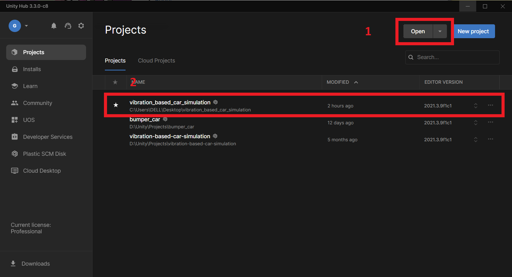

# Vibration-based Car Simulation

## Table of Contents

- [About](#about)
- [How to run the program](#getting_started)

## About 

Vibration-based car simulation is the main Unity program wrote for simulating an automated car mounted with a vibration-based harvester

## How to run the program 
### Prerequisite

The program is developed using Unity3D. In order to run the whole project, you need the following software:

- Unity Hub 3.3.0-c8
- Unity3D Editor 2021.3.9f1c1

After you install the editor, open Unity Hub and import the whole project into the Unity Hub, select `Open` and choose the whole folder. Then you will have the project imported, click the project.

You will see the main page like this (if not,. select the view from `Scene` to `game`:

Then you can click the play button on the top center to start playing the simulation.
